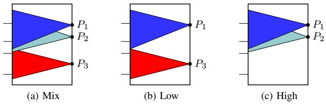
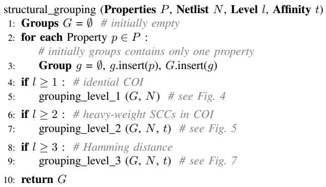
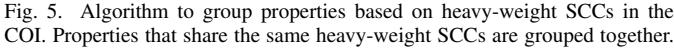
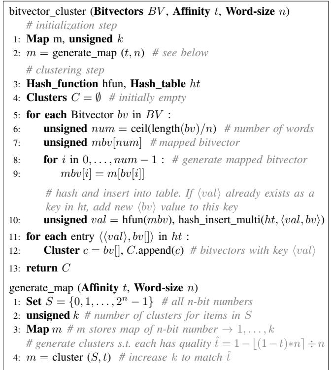
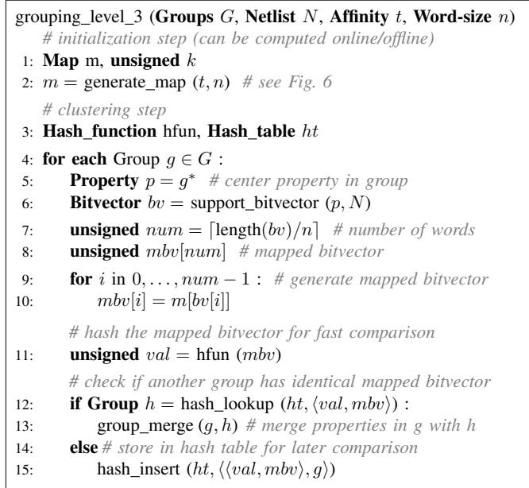
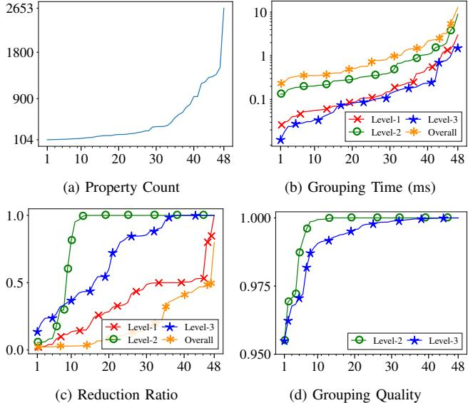
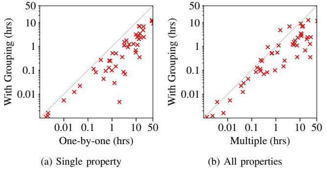
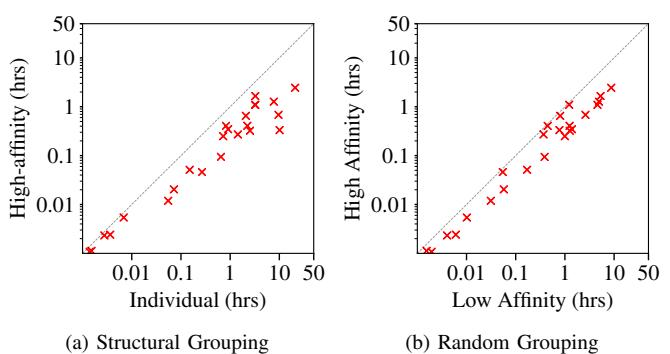

# Boosting Verification Scalability via Structural Grouping and Semantic Partitioning of Properties

Rohit Dureja<sup>∗</sup> , Jason Baumgartner† , Alexander Ivrii† , Robert Kanzelman† and Kristin Y. Rozier<sup>∗</sup> ∗ Iowa State University † IBM Corporation

*Abstract*—From equivalence checking to functional verification to design-space exploration, industrial verification tasks entail checking a large number of properties on the same design. Stateof-the-art tools typically solve all properties concurrently, or one-at-a-time. They do not optimally exploit subproblem sharing between properties, leaving an opportunity to save considerable verification resource via concurrent verification of properties with nearly identical cone of influence (COI). These high-affinity properties can be concurrently solved; the verification effort expended for one can be directly reused to accelerate the verification of the others, without hurting per-property verification resources through bloating COI size. We present a near-linear runtime algorithm for partitioning properties into provably highaffinity groups for concurrent solution. We also present an effective method to partition high-*structural*-affinity groups using *semantic* feedback, to yield an optimal multi-property localization abstraction solution. Experiments demonstrate substantial endto-end verification speedups through these techniques, leveraging parallel solution of individual groups.

# I. INTRODUCTION

The formal verification of a hardware and/or software design often mandates checking a large number of properties. For example, equivalence checking compares pairwise equality of each design output across two designs, and entails a distinct property per output. Functional verification checks designs against a large number of properties ranging from lowlevel assertions to high-level encompassing properties. Designspace exploration via model checking [\[16\]](#page-8-0) verifies multiple properties against competing system designs differing in core capabilities or assumptions.

Each property has a distinct minimal *cone of influence (COI)*, or fanin logic of the signals referenced in that property (Fig. [1a\)](#page-0-0). Verification of a set of properties often entails exponential complexity with respect to the size of its collective COI. *Concurrent* verification of multiple properties may thus be significantly slower than solving these properties one-at-atime, in that each property of the group may add unique fanin logic to the collective COI (Fig. [1b\)](#page-0-1). Conversely, sometimes two or more properties share nearly-identical COIs (Fig. [1c\)](#page-0-2). Concurrent verification of high-affinity properties may save considerable verification resource, as the effort expended for one can be directly reused for the others without significantly slowing the verification of any property within that group (e.g., reusing reachability clauses [\[5,](#page-8-1) [22\]](#page-8-2), and abstractions in localization [\[1\]](#page-8-3) across properties in a group).

Despite the prevalence of multi-property testbenches, little research has addressed the problem of optimal grouping or *clustering* of properties into high-affinity groups. Selective past work [\[7,](#page-8-4) [8\]](#page-8-5) has experimentally demonstrated that ideal

<span id="page-0-0"></span>

<span id="page-0-2"></span><span id="page-0-1"></span>Fig. 1. Cone-of-influence of high- and low- affinity properties.

grouping may save substantial verification resource. However, no scalable online property grouping procedure has been provided; this potential was illustrated as a proof-of-concept using computationally-prohibitive offline grouping algorithms with undisclosed runtime. A significant need thus remains for an effective solution of determining which high-affinity properties should be concurrently solved. To ensure overall scalability, it is essential that such a property-partitioning solution be as close to linear runtime as possible with respect to the number of properties, otherwise the grouping effort itself may severely degrade overall verification resource comprising grouping plus subsequent verification of the identified groups.

*Contributions:* We present a near-linear runtime, fullyautomated algorithm to partition properties into provably highaffinity groups based on structural COI similarity. COI support information is maintained as bitvectors [\[9\]](#page-8-6), and grouping is performed in three configurable levels based on: identical COI, strongly-connected components (SCC) in the COI, and Hamming distance. The properties in each high-affinity group are verified concurrently; each group may be independently verified in parallel, using arbitrary solver algorithms. We also present an algorithm to semantically refine high-structuralaffinity groups in a localization abstraction framework, offering the first optimized multi-property localization solution, to our knowledge. Our partitioning requires negligible resources even on the largest problems, while offering substantial verification speedups as demonstrated by extensive experiments.

# *A. Related Work*

Much prior work has addressed methods to incrementally reuse information across muliple properties to accelerate specific algorithms. E.g., incremental SAT across proofs of different properties [\[20,](#page-8-7) [21\]](#page-8-8), and reusing verification by-products like invariants [\[13\]](#page-8-9) and interpolants [\[24\]](#page-8-10), can accelerate the verification of high-affinity properties.

Methods to group properties based on high-level design descriptions extract similarity criteria from high-level information unavailable in low-level designs and benchmark formats such as AIGs [\[11\]](#page-8-11). The framework of *local* and *global* proofs [\[18\]](#page-8-12) has been used to derive a "debugging set" of properties to fix before verifying others, implying a property ordering but not a partitioning for minimal collective resource. LTL satisfiability checking has been used to establish logical dependencies between properties [\[14\]](#page-8-13) to dynamically reduce verification resource; however, this work requires a quadratic number of resource-intensive comparisons.

The work most similar to ours is a property-clustering procedure based on COI similarity [\[7,](#page-8-4) [8\]](#page-8-5). While a similar goal, their solution requires a quadratic number of comparisons between properties, rendering it prohibitively expensive on large testbenches. Their experiments do not disclose grouping resource, only subsequent verification speedup. Moreover, this generic clustering approach requires the number of desired groups as an algorithmic parameter. This metric is impossible to predict in practice; it is far superior to allow affinity analysis to automatically determine the optimal number of groups.

# II. PRELIMINARIES

# *A. Definitions*

The logic design under verification is represented as a *netlist*. A netlist contains a directed graph with *gates* represented as vertices, and interconnections between vertices represented as edges. Every gate has an associated function: constants, primary inputs, combinational logic such as AND gates, and sequential logic such as *registers*. Registers each have two associated gates that represent their next-state function, and their initial-value function. Semantically, the value of the register at time "0" equals the value of the initial-value function gate at time "0", and the value of the register at time "i+1" equals that of the next-state function gate at time "i".

Certain gates are labeled as *properties*, formed through standard synthesis of the relevant property specification language. The *fanin* of a property refers to the set of gates in the netlist which may be reached by traversing the netlist edges backward from the property gate. This fanin cone is called the *coneof-influence* (COI) of the property. The registers and inputs in the COI are called *support variables*. The number of support variables in the COI is the COI *size*.

We say that a *strongly connected component* (SCC) in the netlist is a set of interconnected gates such that there is a nonempty directed path between every pair of gates in the same SCC. In particular a primary input does not belong to any SCC, and in a well-formed SCC every directed cycle has at least one register because a netlist must be free of combinational cycles. The number of registers in a SCC is its *weight*

# *B. Cone-of-Influence Computation*

Support variable information may be represented as an indexed array of Boolean values, or bitvector, per property. Fig. [2](#page-1-0) gives a high-level procedure to compute a support bitvector for a property p. Every support variable in the netlist N is indexed to an unique position in the bitvector, and index(v) returns that index for variable v. The function fanin(p) recursively computes the fanin structure, or COI, of the gate

$$\begin{array}{l}\textbf{support\\_bitvector } (\textbf{Property } p, \textbf{Next} \text{ is } N) \\\textbf{a: } \textbf{Bitvector } bv \\\textbf{2: } \textbf{for each support variable } v \in N: \\\textbf{3: } \begin{array}{l}\textbf{unsigned\ i = index(v)} \ \# \text{ index\ of\ variable\'s\ bit\ in\ bv \\\textbf{if } v \in \text{fanin}(p) : bv[i] = 1 \ \textbf{else} \ bv[i] = 0 \\\textbf{s. } \textbf{return\ } bv \end{array} \\\end{array}$$

<span id="page-1-0"></span>Fig. 2. High-level procedure to compute support variable information for a property. Every variable is uniquely indexed into the bitvector.

corresponding to property p. If a support variable v is in the fanin of property p, then the index(v)'th bit is set to "1" in the bitvector; otherwise, is set to "0". The length of such a bitvector is equal to the total number of support variables in the netlist, and all bitvectors have the same length. The COI size of the property is the number of bits set to "1", and can be computed using fast population counting algorithms [\[31\]](#page-8-14).

The bitvectors can be *packed* by representing every SCC as a single weighted support variable; SCC bits have weight equal to the SCC weight, while others have unit-weight. The COI size of the property equals the weighted sum of the bits set to "1". Note that the choice of whether or not to represent SCCs as a single bit does not affect the resulting support size. Unless stated otherwise, a "support bitvector" is assumed packed.

Practically, it is far too computationally expensive to walk the fanin cone of every property independently. Instead, the netlist may be traversed once in a topological manner, computing intermediate support bitvectors for internal gates [\[9\]](#page-8-6). E.g., for an AND gate a<sup>1</sup> with incoming edges i<sup>1</sup> and i2, the intermediate bitvector for a<sup>1</sup> is simply the disjunction over the bitvectors for i<sup>1</sup> and i2. For more details on support bitvector computation and optimizations, we refer the reader to [\[9\]](#page-8-6).

# *C. Property Affinity*

The *unpacked* bitvectors for every property can be analyzed to determine *affinity* among the properties. We use "Hamming distance" as an affinity measure; high-affinity properties have nearly-identical bitvectors. The affinity between properties p<sup>1</sup> and p<sup>2</sup> with *unpacked* bitvectors bv<sup>1</sup> and bv<sup>2</sup> is:

$$0 \le \text{affinity}(p\_1, p\_2) = 1 - \frac{\text{hamning}(bv\_1, bv\_2)}{\text{length}(bv\_1)} \le 1.0$$

where hamming(bv1, bv2) is the Hamming distance between the *unpacked* bitvectors, and length(bv1) is the number of support variables in the netlist (identical for every bitvector). Let V<sup>1</sup> and V<sup>2</sup> be the set of support variables in the COI of p<sup>1</sup> and p2, respectively. Note that hamming(bv1, bv2) equals (|V<sup>1</sup> ∪ V2| − |V<sup>1</sup> ∩ V2|) and length(bv1) ≥ |V<sup>1</sup> ∪ V2|.

# *D. Group Center and Grouping Quality*

A property p is selected in a group g that represents the group's *center*, or *representative* property, and is denoted as g ∗ . The *quality* of a group g, denoted Q(g), is the minimum affinity between any pair of properties in g, i.e.,

$$Q(g) = \min(\{\text{affinity}(p\_i, p\_j) \mid \forall p\_i, p\_j \in g\})$$

A quality of t implies that *unpacked* bitvectors, of length l, for properties in a group have a maximum Hamming distance of



<span id="page-2-1"></span>Fig. 3. Algorithm to group properties based on structural affinity.

(1 − t) ∗ l. Our grouping algorithms guarantee that the quality of every group will be greater than a specified threshold.

# *E. Localization Abstraction*

The proof or counterexample for a property often only depends on a small subset of its COI logic. *Localization abstraction* [\[1,](#page-8-3) [10,](#page-8-15) [25,](#page-8-16) [26\]](#page-8-17) is a powerful method aimed at reducing netlist size by removing irrelevant logic, transforming irrelevant gates to unconstrained primary input variables via *cutpoint* insertion. Since cutpoints can simulate the behavior of the original gates and more, the localized netlist overapproximates the behavior of the original netlist. Abstraction *refinement* is used to eliminate cutpoints which are deemed responsible for any spurious counterexamples, effectively reintroducing previously-eliminated logic. Ultimately, the abstract netlist is passed to a proof engine. It is desirable that the abstract netlist be as small as possible to enable more-efficient proofs, while being immune to spurious counterexamples.

# III. STRUCTURAL GROUPING OF PROPERTIES

Practical industrial verification tasks often entail hundreds of thousands of support variables, and tens of thousands of properties. The need for scalability obviates straightforward approaches, such as pairwise-comparing each property to check for affinity. We use support bitvectors for a set of properties, and partition them into high-affinity property groups. Our affinity-based algorithm performs grouping in three configurable levels based on: identical bitvectors (level-1), weights of large SCCs in support (level-2), and Hamming distance between bitvectors (level-3). The underlying intuition is that properties with similar bitvectors, measured in terms of a distance metric like Hamming distance, have high structural affinity and can be most efficiently verified as one concurrent multi-property verification task. To ensure overall scalability, each level runs in as close to linear runtime as possible with respect to the number of properties, otherwise the grouping effort itself may severely degrade overall verification resource comprising grouping plus verification of the identified groups.

Fig. [3](#page-2-1) shows our leveled structural grouping algorithm. It takes as input the properties P, netlist N, and desired grouping level l. Additionally, an affinity threshold t controls the quality of groups formed. Each property is initially assigned its own

```
grouping level 1 (Groups G, Netlist N)
1: Hash function hfun, Hash table ht
2: for each Group g ∈ G :
3: Property p = g
                     ∗ # center property in group
4: Bitvector bv = support bitvector (p, N)
      # hash the bitvector for fast comparison
5: unsigned val = hfun (bv)
      # check if another group has identical bitvector
6: if Group h = hash lookup (ht,hval, bvi) :
7: group merge (g, h) # merge properties in g with h
8: else # store in hash table for later comparison
9: hash insert (ht,hhval, bvi, gi)
```
<span id="page-2-0"></span>Fig. 4. Algorithm to group properties based on identical COI. Properties for which bitvectors hash to the same value are grouped together.

distinct group, i.e., each group contains only one property. Upon termination, properties in a group are checked concurrently using a verification algorithm portfolio, and different groups are verified independently.

# *A. Level-1 Grouping – Identical COI*

The procedure to perform property grouping based on identical support bitvectors is demonstrated in Fig. [4.](#page-2-0) The procedure takes an initial property grouping as input, and then merges groups that have identical support bitvectors. g ∗ denotes the representative property in a group, i.e., g ∗ is the center. The choice of g ∗ is trivial at level-1 because every group contains only one property. Next, the support bitvector for the center property in the group is hashed to an integer value. The choice of the hash function is implementationdependent. We use Murmur3 [\[2\]](#page-8-18) to hash bitvectors as being very fast and accurate with minimal collisions, however, other functions can also be used. Groups for which the bitvector hashes to the same integer value, and further which have identical bitvectors, are then merged. Any property in the merged group can be chosen as the new center property without affecting subsequent results.

<span id="page-2-2"></span>Theorem 1. *Level-1 grouping generates high-affinity property groups* G *such that* ∀g ∈ G : Q(g) = 1.0*.*

*Proof.* Initially, every group contains one property. Properties with identical bitvectors, i.e., affinity = 1.0, are grouped.

While scalable (near-linear runtime) and able to group properties with 100% affinity, in practice it is desirable to perform additional grouping of properties which have a small tolerable Hamming distance yet are still high-affinity. Again, we stress that a simple procedure of pairwise comparison to check whether properties are within a small tolerance is prohibitively slow in practice, rendering prior techniques as [\[7,](#page-8-4) [8\]](#page-8-5) unusable in practice. The following algorithms solve this goal of high-affinity group merging, with high scalability and guaranteed grouping quality.

# *B. Level-2 Grouping – Heavy-weight SCCs in COI*

Many practical netlists contain at least one very large SCC, comprising the majority of its registers. For such netlists,

| grouping level 2 (Groups G, Netlist N, Affinity t)<br>1: Trie trie # initially empty |
|--------------------------------------------------------------------------------------|
| 2: Weight w # set heuristically                                                      |
| 3: for each Group g ∈ G :                                                            |
| ∗ # center property in group<br>Property p = g<br>4:                                 |
| Bitvector bv = support bitvector (p, N)<br>5:                                        |
| # find SCCs with weight ≥ w in COI of property p                                     |
| Set S = find sccs (p, N, w)<br>6:                                                    |
| unsigned scc weight = cumulative weight(S)<br>7:                                     |
| # check if SCCs contain t% of support variables                                      |
| if scc weight/length(bv) < t :<br>8:                                                 |
| continue # SCCs can't decide affinity for group g<br>9:                              |
| # check if another group has exact same SCCs in support                              |
| if Group h = trie lookup (trie, S) :<br>10:                                          |
| # merge properties in g with h                                                       |
| group merge (g, h)<br>11:                                                            |
| else # store in trie for later comparison<br>12:                                     |
| trie insert (trie,hS, gi)<br>13:                                                     |
|                                                                                      |

<span id="page-3-0"></span>

all properties that contain the same heavy-weight SCCs in their COI can often be grouped together as having high affinity. Fig. [5](#page-3-0) demonstrates the procedure to perform property grouping based on heavy-weight SCCs. The procedure takes as input an affinity threshold t. For every group g, we find all SCCs in the COI of the center property p = g ∗ , with weight at least w. We use Tarjan's algorithm to find SCCs in the COI of property p in linear runtime. Practically, it is very expensive to find SCCs in the COI of every property independently. Instead, all SCCs are computed once for netlist N along with the linear traversal to compute support bitvectors for properties [\[23\]](#page-8-19). If the cumulative SCC weight is at least t times the number of support variables in netlist N, this set of SCCs is inserted into a prefix tree or trie (for fast ∼linear time lookup and prefix matching). A hash table may be used, at the expense of possibly-increased memory footprint. If the trie already contains this set of SCCs, albeit for another group h, the two groups are merged. Any property in the merged group can be chosen as the new center property without affecting subsequent results.

<span id="page-3-2"></span>Theorem 2. *Given affinity* t*, level-2 grouping generates property groups* G *such that* ∀g ∈ G : Q(g) ≥ t*.*

*Proof. (Sketch)* Let n be the number of support variables. Properties with identical heavy-weight SCCs in their COI that contain t% of the variables have the same t ∗ n bits set to "1" in their *unpacked* bitvectors, implying a maximum Hamming distance of (1 − t) ∗ n or minimum affinity of t.

Properties sharing a small number of common large SCCs may thus be adequately high-affinity to group based solely upon analysis of these SCCs, without needing to consider a potentially very large number of non-SCC support variables or smaller SCCs. In contrast, storing every full bitvector in a trie may become computationally expensive and serve little benefit. Since the subsequent level-3 grouping does take non-



5: return m

<span id="page-3-1"></span>Fig. 6. Algorithm to cluster bitvectors based on Hamming distance. The initialization step may be computed offline and reused across runs.

SCC support variables into account, minimum SCC weight w is typically set to at least 1% of the total number of support variables in the netlist, and possibly substantially larger like 10%, for fastest runtime without impacting grouping results.

# <span id="page-3-3"></span>*C. Level-3 Grouping – Hamming distance*

Classical clustering techniques, like k-medoids [\[28\]](#page-8-20) (O(n 2 ) time complexity) and heirarchical clustering based on a distance metric like Hamming distance [\[29\]](#page-8-21) (O(n 2 logn) time complexity), are slow and do not scale well with the number of clustered items [\[3\]](#page-8-22). They require expensive computation of a distance matrix that maintains the distance between every pair of items (guaranteed to require at least quadratic resources), and the number of clusters to generate as an input parameter. In a verification context, it is prohibitively slow to perform a quadratic number of bitvector comparisons [\[7,](#page-8-4) [8\]](#page-8-5) on netlists with millions of support variables. Plus, it is impossible to a-priori know how many high-affinity groups are a natural fit for the given multi-property netlist, until the affinity analysis and grouping are completed. Classical clustering algorithms are thus unsuitable for our goal.

A third component of our grouping procedure is an approximate clustering algorithm to scalably cluster bitvectors based on Hamming distance. Fig. [6](#page-3-1) demonstrates the clustering algorithm. The algorithm takes as input a set of *unpacked* bitvectors BV , word size n, and an affinity threshold t. As an initialization step, the algorithm first uses an offthe-shelf clustering algorithm [\[19,](#page-8-23) [29\]](#page-8-21) to cluster all n-bit numbers into k clusters such that quality of every cluster is at least tˆ = 1 − b(1 − t)∗ne ÷ n (bxe is the nearest integer function); a map m is maintained that maps every n-bit number (0, 1, . . . , 2 <sup>n</sup> − 1) to the allotted cluster center (1, . . . , k). For a fixed value of n, the number of clusters k can be increased one-by-one until quality of each is at least tˆ, i.e. the maximum Hamming distance allowed per n-bit segment in a cluster is (1 − tˆ) ∗ n. E.g. for n = 32 and t = 0.95, the maximum hamming distance is (1 − 0.95) ∗ 32 = 1.6 ≈ 2 for which tˆ= 0.9375. It is important to note that the initialization step involving clustering does not hinder scalability because:

- 1) The value of n is typically less than the maximum CPU word size that allows fast single-cycle Hamming distance computation between two numbers (xor); clustering with t = 0.9 for n=16 and 32 takes <1s and <1min, resp.
- 2) The map can be computed once offline, and reused in all future runs of the algorithm (e.g. embedded into a verification tool) for various ranges of threshold t.
- 3) For online computation, an approximate linear-time algorithm, like Gonzalez [\[19\]](#page-8-23), can be used on S that may only contain n-bit numbers appearing in bitvectors BV .

In the clustering step, every *unpacked* bitvector bv is read in n-bit segments to generate a piecewise-mapped bitvector mbv using map m. Bitvectors for which the corresponding mapped bitvectors hash to the same value are put in the same cluster.

<span id="page-4-1"></span>Theorem 3. *Given unpacked bitvectors* BV *, affinity* t*, and word size* n*,* bitvector cluster *returns clusters* C *such that* ∀c ∈ C : Q(c) ≥ tˆ*, where* tˆ= 1 − b(1 − t)∗ne ÷ n*.*

*Proof. (Sketch)* Assume generate map() creates clusters from n-bit numbers in S such that minimum affinity between numbers in each cluster is tˆ, implying a Hamming distance of (1−tˆ)∗n. Let each *unpacked* bitvector bv ∈ BV contain num n-bit segments, i.e., length(bv) = n ∗ num. If two mapped bitvectors hash to the same value, then every i th n-bit segment in the two original *unpacked* bitvectors is at a maximum distance of (1 − tˆ) ∗ n. Therefore, the maximum distance between the two *unpacked* bitvectors is (1 − tˆ) ∗ n ∗ num or (1 − tˆ) ∗ length(bv), implying a minimum affinity of tˆ.

Fig. [7](#page-4-0) demonstrates the procedure to perform property grouping based on Hamming distance using the bitvector clustering algorithm of Fig. [6.](#page-3-1) The algorithm generates a map m of n-bit numbers to cluster centers 1, . . . , k as an initialization step. The center property *unpacked* bitvector for every group is read per n-bit segment, to generate a mapped bitvector using map m. The mapped bitvector is hashed to an integer value. The groups for which the center property mapped bitvectors hash to the same value, and further which have identical mapped bitvectors, are immediately merged.

Theorem 4. *Given affinity* t *and word size* n*, level-3 grouping generates property groups* G *such that* ∀g ∈ G : Q(g) ≥ 2 ∗ t + tˆ− 2*, where* tˆ= 1 − b(1 − t)∗ne ÷ n*.*

*Proof. (Sketch)* The proof follows from triangle inequality of Hamming distance. Let m be the length of *unpacked* bitvectors. For groups g<sup>1</sup> and g2, if center property bitvectors



<span id="page-4-0"></span>Fig. 7. Algorithm to group properties based on Hamming distance. Properties for which mapped bitvectors hash to the same value are grouped together.

hash to the same value then the bitvectors are at a distance of at most (1−tˆ)∗m (Theorem [3\)](#page-4-1). Properties within groups g<sup>1</sup> and g<sup>2</sup> are at a maximum distance of (1−t)∗m (Theorems [1](#page-2-2) & [2\)](#page-3-2) from their respective center properties. Therefore, maximum distance between a property in g<sup>1</sup> and another property in g<sup>2</sup> is 2 ∗ (1 − t) ∗ m + (1 − tˆ) ∗ m, or (1 − (2 ∗ t + tˆ− 2)) ∗ m, implying a minimum affinity of 2 ∗ t + tˆ− 2.

When tˆ= t, level-3 returns groups with Q(g) ≥ 3 ∗ t − 2. Despite its provable threshold, there is some asymmetry in this approach, in that two fairly-high-affinity bitvectors which differ too much in a single segment will not be merged, whereas if the difference was small per-segment with multiple segments differentiated, they may be merged, albeit respecting the quality bound. The highly scalable analysis can be repeated if higher precision and symmetry is desired. This can be done either as-is on the entire netlist under different permutations or segment-partitioning of bitvector indices (i.e., by varying the starting index of the first n-bit segment in the bitvector), or on individual (sets of) groups obtained from the prior run. Since re-running on a subset of properties implies a smaller coneof-influence, bitvectors can be compacted for faster runtime to only include support variables in the COI of any considered property, and this indexing will differ from the prior run over a larger set of properties. Moreover, support variables present in the COI of every property can be completely projected out of the bitvectors to offer further compaction and speedup.

# IV. SEMANTIC REFINEMENT OF PROPERTY GROUPS

It is desirable that the netlist generated by localization abstraction be as small as possible to enable efficient proofs. Localization cutpoints are property-specific, hence concurrent localization of properties with disjoint COIs - or even similar COIs - may yield significantly larger netlists which are less

```
localization (Group g, Netlist N, Limit n, Threshold t)
1: Netlist L # localized netlist
2: L = initial abstraction(g) # add gates for every property
3: unsigned k = 0 # bmc depth
4: bool stop = 0 # some properties fail at depth k
5: while not stop : # loop until all properties pass at depth k
6: stop = 1
7: Gates c = {} # cutpoints to refine in L, initially empty
8: for each Property p ∈ g :
9: Result r = run bmc(L, p, k) # run bmc with depth k
10: if r == unsat : continue # property passes
          # check counterexample returned by bmc
11: if cex not spurious : report solved(p, cex), continue
12: stop = 0 # property fails
13: Gates d = cutpoints to refine(), c = c ∪ d
14: collect support info(p, d) # add to support bitvector
      # at least one property passes at depth k
15: if not stop : refine abstraction(L, c), unchanged = 0
16: else unchanged + = 1 # no change in abstraction
   # check if netlist unchanged for last n bmc steps
17: if unchanged < n : k = k + 1, goto line 4 # increment depth
18: else Groups Gˆ = structural grouping(g, L, 3, t)
   # run proof engine for each group in Gˆ with netlist L
   . . .
```
<span id="page-5-1"></span>Fig. 8. Localization to partition a group g of high-affinity properties. BMC is run for increasing depth until there is no change in the localized netlist, after which partitioning is attempted to split g into subgroups Gˆ.

scalable to verify. Our structural property grouping procedure ensures that only high-affinity properties in a group will be localized concurrently, which helps ensure smaller multiproperty abstractions. However, it might be the case that a cutpoint is refined for one property in a high-affinity group, whereas that refinement may be unnecessary for another property in the group. As a result, properties in a highaffinity group without localization cutpoints may have vastly different COI in the localized netlist. Therefore, partitioning the group obtained from Fig. [3](#page-2-1) into high-affinity localized subgroups based upon localization decisions can improve overall verification scalability.

# <span id="page-5-0"></span>*A. Generating Support Bitvectors*

Various techniques have been proposed [\[1,](#page-8-3) [10,](#page-8-15) [25\]](#page-8-16) to guide the abstraction-refinement process of localization. Most state-of-the-art localization implementations use SAT-based bounded model checking (BMC) [\[4\]](#page-8-24) to select the localized netlist upon which an unbounded proof is attempted. In our implementation we run BMC iteratively until there is no change in the localized netlist. Fig. [8](#page-5-1) shows our localization abstraction framework that supports high-affinity group partitioning. We start with a localized netlist only containing property gates. For a given BMC depth k, we iterate over properties in group g to eliminate all spurious counterexamples of length k. Cutpoints deemed necessary to refine for a property p are collected (line 13). If a cutpoint is also a support variable, it is then added to the support bitvector maintained for property p (line 14). The abstraction is then refined using the collected cutpoints, and BMC is run again at depth k. When all properties hold for the abstract model at depth k, BMC is run again with depth k + 1. The repeated BMC runs add new cutpoints to the support bitvector for every property, which in turn can be used to partition group g into highaffinity subgroups with respect to the localized netlist. Various strategies may be used to decide when to terminate BMC: an upper-bound on BMC depth or runtime can be used. In our framework, we prefer increasing BMC depth until there is no change in the localized netlist for n consecutive steps (lines 17–18). The value of n can be varied to increase confidence in the abstracted model such that it is immune to spurious counterexamples.

# *B. Group Partitioning*

Once BMC converges, group g is then partitioned into subgroups Gˆ based on support bitvector information. Note that the problem is analogous to grouping of properties in g with respect to the localized netlist. Therefore, we use the property grouping procedure of Fig. [3](#page-2-1) to generate high-affinity property groups for overall scalability. [1](#page-5-2) The properties in each subgroup are then passed to a proof engine for verification with respect to each COI-reduced localized subgroup's netlist.

# V. EXPERIMENTAL RESULTS

We experimentally analyze the impact of our grouping procedure on end-to-end verification scalability.[2](#page-5-3) Our grouping procedure is implemented within *Rulebase: Sixthsense Edition* [\[27\]](#page-8-25). All experiments were run on Linux machines, with 32GB memory. Time reported is 'cpu' time. We refer to different grouping levels as L1, L2, and L3.

# *A. Benchmarks from HWMCC*

We evaluate 48 benchmarks from HWMCC that contain more than 100 safety properties (Fig. [9a\)](#page-6-0). These are obtained by simplifying all the benchmarks by standard logic synthesis (similar to &dc2 in ABC [\[6\]](#page-8-26)) to solve easy properties, and disjunctive decomposition to fragment each OR-gate property into a sub-property of its literals. Each property, or property group, is solved using a portfolio comprising BMC [\[4\]](#page-8-24), IC3 [\[5,](#page-8-1) [15\]](#page-8-27), and localization (LOC) without semantic partitioning. Each can process multiple properties: IC3 and BMC in a timesharing manner, and LOC concurrently abstracting a set of properties which are solved using IC3.

*a) Property Grouping:* Support bitvector computation is fast, and takes less than five seconds on the largest benchmark. The ideal threshold is benchmark- and solver-specific. Given the exponential penalty of grouping lower-affinity properties vs. linear penalty of splitting higher-affinity properties (offset by parallel solving), we find it best to err to the latter using a higher affinity t=0.9. L<sup>3</sup> is done using 16-bit words and

<span id="page-5-2"></span><sup>1</sup>Off-the-shelf clustering is more applicable here than on the original netlist if desired, because: (1) the localized netlist and support bitvectors are often immensely smaller than the original netlist; (2) the number of properties per structural group being localized is often smaller than the number of overall netlist properties. However, there is no guarantee of either of these points.

<span id="page-5-3"></span><sup>2</sup>Detailed results available at http://temporallogic.org/research/FMCAD19

<span id="page-6-0"></span>

<span id="page-6-3"></span><span id="page-6-2"></span>Fig. 9. Grouping on 48 HWMCC benchmarks with more than 100 properties, and maximum 50 properties/group. Level-1 grouping quality is 1.0.

<span id="page-6-4"></span>

<span id="page-6-5"></span>Fig. 10. End-to-end verification with grouping vs. portfolio which (a) checks properties one-at-a-time, and (b) check all properties together. Points below diagonal are in favor of verification with grouped properties.

tˆ = 0.875, i.e., maximum distance of 2 between words (Fig. [6\)](#page-3-1). Initially each property is assigned to its own distinct group. The grouping takes less than 10ms for all benchmarks (Fig. [9b\)](#page-6-1). The group count reduction ratio for each level with respect to the preceding level, and overall reduction ratio, i.e., number of groups relative to preceding level, is shown in Fig. [9c.](#page-6-2) L<sup>2</sup> merges properties for 13 benchmarks: <0.5 ratio for 8 benchmarks, and is critical to the performance of L3. Without L<sup>1</sup> and L2, not all properties merged by L<sup>2</sup> are merged by L<sup>3</sup> due to inherent asymmetry, and L<sup>3</sup> can merge the same properties as L1, albeit, with small runtime penalty. Therefore, the leveling order is crucial and gives tighter control on group affinity. Fig. [9d](#page-6-3) shows the minimum quality of all non-singleton groups in a benchmark.

*b) End-to-end Verification:* We compare the runtime of checking each property one-by-one vs. checking property groups in Fig. [10a;](#page-6-4) verification with structural grouping is up to 400× (median 4.3×) faster. A fairer comparison of the runtime of checking all properties together vs. checking property groups is shown in Fig. [10b;](#page-6-5) grouped verification is up to 72× (median 3.5×) faster. Table [I](#page-6-6) shows benchmarks for

<span id="page-6-6"></span>TABLE I VERIFICATION WITH ONE-BY-ONE, MULTIPLE, AND GROUPED PROPERTIES

| Name      | #Prop | One-by-one | Multiple | #G  | Grouped |
|-----------|-------|------------|----------|-----|---------|
| 6s281     | 105   | 0.32h      | 0.22h    | 84  | 0.26h   |
| bobsmvhd3 | 138   | 4.36h      | 0.43h    | 53  | 0.92h   |
| 6s380     | 149   | 1.92h      | 12.54s   | 12  | 16.95s  |
| bob12s08  | 206   | 13.04h     | 3.45h    | 88  | 6.80h   |
| 6s381     | 1506  | 18.60h     | 1.45h    | 192 | 4.76h   |

<span id="page-6-8"></span><span id="page-6-1"></span>

<span id="page-6-9"></span><span id="page-6-7"></span>Fig. 11. Verification performance of (a) high and (b) low affinity grouping on LOC with respect to checking all properties one-by-one.

which checking all properties together is faster. LOC solves very few properties for these benchmarks, whereas, BMC/IC3 quickly verify all properties together: 145 properties in 6s380 are falsified by BMC in a few unrollings and remaining proved by LOC, while all properties are proved by LOC or IC3 for other benchmarks. The benchmarks in Table [I](#page-6-6) have properties where a large majority are either all falsified, or proved. The advantage of checking high-affinity groups is outweighed by the added cost of repeating BMC/IC3 across groups for these benchmarks, which could be adjusted for using a lower affinity threshold. However, grouping advantage is apparent for benchmarks in which no single algorithm solves all properties, and properties have different verification outcomes.

*c) Localization Abstraction:* We select 24 benchmarks having at least 50 properties solved by LOC. Properties not solved by LOC are not considered. Fig. [11](#page-6-7) shows the impact of high and low affinity grouping on the performance of LOC. If high-affinity structural grouping returns N groups, lowaffinity grouping is done by sorting properties by COI size, and partitioning into equally-sized N groups. Fig. [11a](#page-6-8) compares verification of high-affinity grouped properties and one-byone checking of each property with LOC; verification is up to 30× (median 2.9×) faster. On the other hand, low-affinity groups often degrade LOC performance compared to one-byone checking. Fig. [11b](#page-6-9) compares high and low affinity group verification with LOC. Five benchmarks have comparable performance due to grouping of large number of properties into very few groups. Nevertheless, high-affinity verification is always faster: up to 3.7× (median 2.5×).

*d) Semantic Partitioning:* LOC generates a localized netlist using BMC for every property group which is then checked by a proof engine. If the localization is sufficient,

<span id="page-7-0"></span>TABLE II VERIFICATION WITH SEMANTIC PARTITIONING DISABLED/ENABLED

| Name  | Total |     | Single Run |     | Verification Time |         |         |  |
|-------|-------|-----|------------|-----|-------------------|---------|---------|--|
|       | #G    | #P  | #G         | #P  | Disabled          | Enabled | Speedup |  |
| 6s384 | 2     | 51  | 1          | 27  | 22.65s            | 36.76s  | 0.61×   |  |
| 6s344 | 12    | 247 | 3          | 65  | 2.04h             | 0.65h   | 3.13×   |  |
| 6s405 | 13    | 593 | 3          | 134 | 0.28h             | 0.21h   | 1.34×   |  |
| 6s410 | 15    | 735 | 4          | 121 | 0.18h             | 0.12h   | 1.50×   |  |
| 6s110 | 15    | 186 | 5          | 73  | 82.13s            | 81.43s  | 1.00×   |  |
| 6s391 | 30    | 144 | 9          | 32  | 25.61s            | 43.12s  | 0.60×   |  |
| 6s332 | 77    | 163 | 16         | 45  | 1.21h             | 0.75h   | 1.62×   |  |

TABLE III COMPARISON WITH HIERARCHICAL CLUSTERING

<span id="page-7-1"></span>

| Name   | #P    |      | Our Procedure |         |     | Hierarchical |         |       |
|--------|-------|------|---------------|---------|-----|--------------|---------|-------|
|        |       | #G   | G.Time        | V.Time  | #G  | G.Time       | V.Time  | #Loss |
| 6s405  | 593   | 13   | 2.16ms        | 1.04h   | 13  | 12.43s       | 1.04h   | 0     |
| 6s381  | 1506  | 192  | 5.93ms        | 4.76h   | 76  | 36.62s       | 3.01h   | 96    |
| 6s361  | 2653  | 84   | 12.71ms       | 355.76s | 62  | 107.14s      | 293.14s | 11    |
| 6s117* | 8063  | 173  | 25.53ms       | 8.13h   | 165 | 1.07h        | 7.45h   | 4     |
| 6s114* | 30628 | 1612 | 0.42s         | 0.76h   | 873 | 2.65h        | 0.52h   | 412   |

\* Not simplified by logic synthesis

the proof engine may prove all properties in a single run. Otherwise, it generates a possibly-spurious counterexample. Table [II](#page-7-0) shows benchmarks in which some non-singleton groups are proved by LOC in a single proof-engine run. We perform semantic partitioning on these groups. 'Total' shows the #Groups generated by structural grouping for #Props, whereas, 'Single Run' shows the #Groups and #Props solved by one proof engine run after generating a sufficient localized netlist. All groups are solved by LOC one-by-one. As is evident, semantic partitioning boosts the performance of LOC for hard problems (in bold). However, there is a marginal slowdown for easy problems due to the overhead of restarting the proof engine on semantically partitioned subgroups.

*e) Lossy Grouping:* Lastly, we compare the grouping loss using our procedure with hierarchical clustering (HC) [\[29\]](#page-8-21). We measure loss as #properties assigned a group by HC but not our procedure (maximum 50 properties/group). Table [III](#page-7-1) summarizes results for five representative benchmarks. HC always takes more grouping time. There is no loss in benchmarks for which both methods return very few groups (e.g., 6s405). Verification with fewer groups from HC is faster (e.g., 6s381) when our procedure has higher loss. This loss may be due to 1) properties having an almost identical set of SCCs but differing in a few small SCCs: these are not grouped due to trie prefix mismatch, and 2) asymmetry in L3, which can be mitigated by using techniques in Sec. [III-C.](#page-3-3) In most cases, HC gives fewer groups which may result in less verification time, but HC grouping resource results in an end-to-end runtime degradation vs. our approach. It is clear that HC gives tighter groups but overall verification resource is dominated by the time it takes to perform grouping.

# *B. Proprietary Designs*

Post-silicon observability solutions often leverage monitoring logic instrumented throughout a hardware design. This *debug bus* logic monitors a configurable set of internal signals

TABLE IV VERIFICATION OF PROPRIETARY DEBUG BUS DESIGNS

<span id="page-7-2"></span>

| ID | #P    | #G   | G.Time | Verification Time |         |         |  |
|----|-------|------|--------|-------------------|---------|---------|--|
|    |       |      | (ms)   | One-by-one        | Grouped | Speedup |  |
| 1  | 36    | 9    | 0.48   | 32.69s            | 19.27s  | 1.70×   |  |
| 2  | 45    | 3    | 0.49   | 26.24s            | 12.63s  | 2.08×   |  |
| 3  | 56    | 5    | 0.94   | 11.9s             | 6.34s   | 1.88×   |  |
| 4  | 76    | 36   | 3.87   | 0.21h             | 0.14h   | 1.40×   |  |
| 5  | 148   | 4    | 0.68   | 95.83s            | 22.68s  | 4.23×   |  |
| 6  | 224   | 6    | 0.74   | 65.52s            | 19.65s  | 3.34×   |  |
| 7  | 1506  | 53   | 9.16   | 0.93h             | 0.21h   | 4.32×   |  |
| 8  | 9371  | 1027 | 137.72 | 52.65h            | 11.89h  | 4.43×   |  |
| 9  | 11035 | 1238 | 146.32 | 7.94h             | 2.81h   | 2.82×   |  |

in real-time, non-intrusively while the chip is functionally running. Debug bus verification entails a large number of properties (often one per monitor point), within very large design components - sometimes entire chips [\[17\]](#page-8-28). Localization is the dominant method to verify debug bus designs as they often contain >10M gates [\[17\]](#page-8-28). Note that concurrent verification of all properties is completely intractable. Table [IV](#page-7-2) summarizes our results. 'One-by-one' shows verification time by localizing one property at a time, whereas, 'Grouped' represents concurrent localization of properties in a high-affinity group. All designs benefit from high-affinity group verification, and the speedup is clearly evident for large designs (in bold).

# VI. CONCLUSIONS AND FUTURE WORK

Scalable property grouping is a hard problem. Existing approaches are either syntax-based [\[11\]](#page-8-11), or resource intensive [\[7\]](#page-8-4). The need for scalability cannot be over-stated; traditional grouping algorithms require at least quadratic runtime vs. number of properties, and are prohibitively slow–adding to and easily outweighing the benefit they bring to the verification process. We present a 2-step grouping strategy: strucural grouping followed by semantic partitioning, that offers massive end-to-end verification speedup. Experiments demonstrate the usefulness of our method on several verification tasks: structural grouping is trivially fast regardless of subsequent verification engines, and semantic partitioning accelerates difficult localization problems. We advance state-of-the-art in localization by providing an optimal multi-property solution.

Future work includes improved ordering and compaction of support bitvector bits to improve performance, e.g., support variables present in every property can be projected out of the bitvectors. Dynamic trie matching that discounts differences in very small SCCs in COI for properties, may improve level-2 grouping. Extending level-3 grouping to work with packed bitvectors may speed up grouping: large SCCs for which any distinction exceeds threshold require identical valuations in grouping, and smaller SCCs are either unpacked to multiple bits or treated with finer-grained map. Clever data structures, such as MA FSA [\[12\]](#page-8-29), and branch-and-bound traversal [\[30\]](#page-8-30) can search for fairly-high-affinity bitvectors that differ in only a few n-bit segments, thereby reducing level-3 asymmetry. Extending semantic partitioning to cases where refinement occurs during a proof engine run is a promising research direction. We plan to investigate how semantic information from BMC and IC3 can be used to perform property grouping.

# ACKNOWLEDGMENTS

We thank the anonymous reviewers for their valuable comments. We thank Gianpiero Cabodi for an insightful discussion on multi-property verification, and Brad Bingham for feedback on early drafts of the paper. This work is partially supported by NSF CAREER Award CNS-1664356.

# REFERENCES

- <span id="page-8-3"></span>[1] N. Amla and K. L. McMillan, "A hybrid of counterexample-based and proof-based abstraction," in *Formal Methods in Computer-Aided Design (FMCAD)*, A. J. Hu and A. K. Martin, Eds. Berlin, Heidelberg: Springer Berlin Heidelberg, 2004, pp. 260–274.
- <span id="page-8-18"></span>[2] A. Appleby, "SMHasher and MurmurHash3," [https://github.com/](https://github.com/aappleby/smhasher) [aappleby/smhasher,](https://github.com/aappleby/smhasher) accessed: 2019-04-12.
- <span id="page-8-22"></span>[3] D. Arthur and S. Vassilvitskii, "How slow is the k-means method?" in *Symposium on Computational Geometry (SCG)*. New York, NY, USA: ACM, 2006, pp. 144–153.
- <span id="page-8-24"></span>[4] A. Biere, A. Cimatti, E. Clarke, and Y. Zhu, "Symbolic model checking without bdds," in *Tools and Algorithms for the Construction and Analysis of Systems (TACAS)*, W. R. Cleaveland, Ed. Berlin, Heidelberg: Springer Berlin Heidelberg, 1999, pp. 193–207.
- <span id="page-8-1"></span>[5] A. R. Bradley, "Sat-based model checking without unrolling," in *Verification, Model Checking, and Abstract Interpretation (VMCAI)*, R. Jhala and D. Schmidt, Eds. Berlin, Heidelberg: Springer Berlin Heidelberg, 2011, pp. 70–87.
- <span id="page-8-26"></span>[6] R. Brayton and A. Mishchenko, "ABC: An academic industrial-strength verification tool," in *Computer Aided Verification (CAV)*, T. Touili, B. Cook, and P. Jackson, Eds. Berlin, Heidelberg: Springer Berlin Heidelberg, 2010, pp. 24–40.
- <span id="page-8-4"></span>[7] G. Cabodi, P. E. Camurati, C. Loiacono, M. Palena, P. Pasini, D. Patti, and S. Quer, "To split or to group: from divide-and-conquer to subtask sharing for verifying multiple properties in model checking," *International Journal on Software Tools for Technology Transfer (STTT)*, vol. 20, no. 3, pp. 313–325, Jun 2018.
- <span id="page-8-5"></span>[8] G. Cabodi and S. Nocco, "Optimized model checking of multiple properties," in *Design, Automation Test in Europe (DATE)*, March 2011, pp. 1–4.
- <span id="page-8-6"></span>[9] G. Cabodi, P. Camurati, and S. Quer, "A graph-labeling approach for efficient cone-of-influence computation in model-checking problems with multiple properties," *Software: Practice and Experience*, vol. 46, no. 4, pp. 493–511, 2016.
- <span id="page-8-15"></span>[10] P. Chauhan, E. Clarke, J. Kukula, S. Sapra, H. Veith, and D. Wang, "Automated abstraction refinement for model checking large state spaces using sat based conflict analysis," in *Formal Methods in Computer-Aided Design (FMCAD)*, M. D. Aagaard and J. W. O'Leary, Eds. Berlin, Heidelberg: Springer Berlin Heidelberg, 2002, pp. 33–51.
- <span id="page-8-11"></span>[11] M. Chen and P. Mishra, "Functional test generation using efficient property clustering and learning techniques," *IEEE Transactions on Computer-Aided Design of Integrated Circuits and Systems*, vol. 29, no. 3, pp. 396–404, March 2010.
- <span id="page-8-29"></span>[12] J. Daciuk, S. Mihov, B. W. Watson, and R. E. Watson, "Incremental construction of minimal acyclic finite-state automata," *Computational Linguistics*, vol. 26, no. 1, pp. 3–16, 2000.
- <span id="page-8-9"></span>[13] R. Dureja and K. Y. Rozier, "FuseIC3: An algorithm for checking large design spaces," in *Formal Methods in Computer Aided Design (FMCAD)*, Oct 2017, pp. 164–171.
- <span id="page-8-13"></span>[14] R. Dureja and K. Y. Rozier, "More scalable LTL model checking via discovering design-space dependencies (D<sup>3</sup> )," in *Tools and Algorithms for the Construction and Analysis of Systems (TACAS)*, D. Beyer and M. Huisman, Eds. Cham: Springer International Publishing, 2018, pp. 309–327.
- <span id="page-8-27"></span>[15] N. Een, A. Mishchenko, and R. Brayton, "Efficient implementation of property directed reachability," in *Formal Methods in Computer-Aided Design (FMCAD)*. Austin, TX: FMCAD Inc, 2011, pp. 125–134.
- <span id="page-8-0"></span>[16] M. Gario, A. Cimatti, C. Mattarei, S. Tonetta, and K. Y. Rozier, "Model checking at scale: Automated air traffic control design space exploration," in *Computer Aided Verification (CAV)*, S. Chaudhuri and A. Farzan, Eds. Cham: Springer International Publishing, 2016, pp. 3–22.
- <span id="page-8-28"></span>[17] T. Glokler, J. Baumgartner, D. Shanmugam, R. Seigler, G. V. Huben, B. Ramanandray, H. Mony, and P. Roessler, "Enabling large-scale pervasive logic verification through multi-algorithmic formal reasoning," in *Formal Methods in Computer Aided Design (FMCAD)*, Nov 2006, pp. 3–10.
- <span id="page-8-12"></span>[18] E. Goldberg, M. Gudemann, D. Kroening, and R. Mukherjee, "Efficient ¨ verification of multi-property designs (The benefit of wrong assumptions)," in *Design, Automation Test in Europe (DATE)*, March 2018, pp. 43–48.
- <span id="page-8-23"></span>[19] T. F. Gonzalez, "Clustering to minimize the maximum intercluster distance," *Theoretical Computer Science*, vol. 38, pp. 293 – 306, 1985.
- <span id="page-8-7"></span>[20] Z. Khasidashvili and A. Nadel, "Implicative simultaneous satisfiability and applications," in *Hardware and Software: Verification and Testing (HVC)*, K. Eder, J. Lourenc¸o, and O. Shehory, Eds. Berlin, Heidelberg: Springer Berlin Heidelberg, 2012, pp. 66–79.
- <span id="page-8-8"></span>[21] Z. Khasidashvili, A. Nadel, A. Palti, and Z. Hanna, "Simultaneous SATbased model checking of safety properties," in *Hardware and Software, Verification and Testing (HVC)*, S. Ur, E. Bin, and Y. Wolfsthal, Eds. Berlin, Heidelberg: Springer Berlin Heidelberg, 2006, pp. 56–75.
- <span id="page-8-2"></span>[22] J. Li, R. Dureja, G. Pu, K. Y. Rozier, and M. Y. Vardi, "Simplecar: An efficient bug-finding tool based on approximate reachability," in *Computer Aided Verification*, H. Chockler and G. Weissenbacher, Eds. Cham: Springer International Publishing, 2018, pp. 37–44.
- <span id="page-8-19"></span>[23] C. Loiacono, M. Palena, P. Pasini, D. Patti, S. Quer, S. Ricossa, D. Vendraminetto, and J. Baumgartner, "Fast cone-of-influence computation and estimation in problems with multiple properties," in *Design, Automation Test in Europe (DATE)*, March 2013, pp. 803–806.
- <span id="page-8-10"></span>[24] J. Marques-Silva, "Interpolant learning and reuse in sat-based model checking," *Electronic Notes in Theoretical Computer Science*, vol. 174, no. 3, pp. 31 – 43, 2007, proceedings of the Fourth International Workshop on Bounded Model Checking (BMC 2006).
- <span id="page-8-16"></span>[25] K. L. McMillan and N. Amla, "Automatic abstraction without counterexamples," in *Tools and Algorithms for the Construction and Analysis of Systems (TACAS)*, H. Garavel and J. Hatcliff, Eds. Berlin, Heidelberg: Springer Berlin Heidelberg, 2003, pp. 2–17.
- <span id="page-8-17"></span>[26] A. Mishchenko, N. Een, R. Brayton, J. Baumgartner, H. Mony, and P. Nalla, "GLA: Gate-level abstraction revisited," in *2013 Design, Automation Test in Europe Conference Exhibition (DATE)*, March 2013, pp. 1399–1404.
- <span id="page-8-25"></span>[27] H. Mony, J. Baumgartner, V. Paruthi, R. Kanzelman, and A. Kuehlmann, "Scalable automated verification via expert-system guided transformations," in *Formal Methods in Computer-Aided Design (FMCAD)*, A. J. Hu and A. K. Martin, Eds. Berlin, Heidelberg: Springer Berlin Heidelberg, 2004, pp. 159–173.
- <span id="page-8-20"></span>[28] H.-S. Park and C.-H. Jun, "A simple and fast algorithm for k-medoids clustering," *Expert Systems with Applications*, vol. 36, no. Part 2, pp. 3336 – 3341, 2009.
- <span id="page-8-21"></span>[29] L. Rokach and O. Maimon, *Clustering Methods*. Springer US, 2005, pp. 321–352.
- <span id="page-8-30"></span>[30] R. A. Wagner and M. J. Fischer, "The string-to-string correction problem," *Journal of the ACM*, vol. 21, no. 1, pp. 168–173, jan 1974.
- <span id="page-8-14"></span>[31] H. S. Warren, *Hacker's Delight*, 2nd ed. Addison-Wesley Professional, 2012.